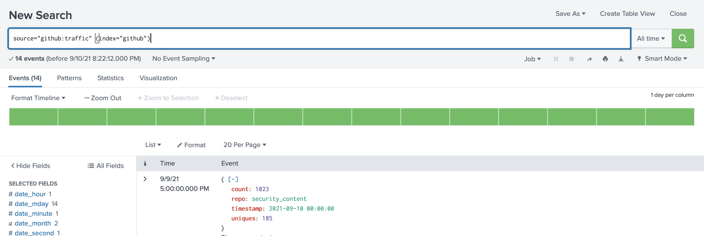

# github-traffic-collector
collects github traffic stats for repos and sends it to splunk as well as writes it to disk.

### Getting started
 
1. [Install](#installation) the tool
2. [Configure](#configuration) your GitHub token
3. [Search](#github-search-examples) for credentials
4. See results `cat results.json | jq`

### Installation 

* requirements: `virtualenv, python3`

1. `git clone https://github.com/d1vious/github-traffic-collector && cd github-traffic-collector` clone project and cd into the project dir
2. `pip install virtualenv && virtualenv -p python3 venv && source venv/bin/activate && pip install -r requirements.txt` create virtualenv and install requirements

Continue to [configuring](#configuration) a GitHub API key

### Configuration [`github-traffic-collector.conf`](https://github.com/d1vious/github-traffic-collector/blob/master/github-traffic-collector.conf)

Make sure you set a GitHub token if you need to create one for your account follow [these](https://help.github.com/en/github/authenticating-to-github/creating-a-personal-access-token-for-the-command-line) instructions. 

```
[global]
github_token = TOKENHERE
# github token for searching

output = results.json
# stores traffic stats in JSON here

log_path = github-traffic-collector.log
# Sets the log_path for the logging file

log_level = INFO
# Sets the log level for the logging
# Possible values: INFO, ERROR

github_repos =
# github repository to pull traffic stats from comma delimited. Example:
# github_repos = security_content, attack_range, attack_data

# send stats directly to splunk HEC
splunk_host = https://127.0.0.1:8088
# please include full url, <http|https>://<splunk_server_url>:<splunk_mgmt_port> format
splunk_hec_token =
# please generate a HEC token on your Splunk Search Head and provide it here
```

### Usage

```
usage: github-traffic-collector.py [-h] -s SEARCH [-c CONFIG] [-v]

optional arguments:
  -h, --help            show this help message and exit
  -c CONFIG, --config CONFIG
                        config file path
  -v, --version         shows current git-wild-hunt version
```

### Splunk
The tool uses the `/services/collector/raw` endpoint to post events to splunk. Keep in mind that HEC runs on port 8088 by default, and you will also need a [HEC token](https://docs.splunk.com/Documentation/Splunk/8.2.2/Data/UsetheHTTPEventCollector) added to the configuration file. Below is a picture of events once they are indexed by Splunk. 



### Author

* Jose Hernandez [@_josehelps](https://twitter.com/_josehelps)

### Contributor 
 * Adam Mashinchi [@Adam_Mashinchi](https://twitter.com/Adam_Mashinchi)
